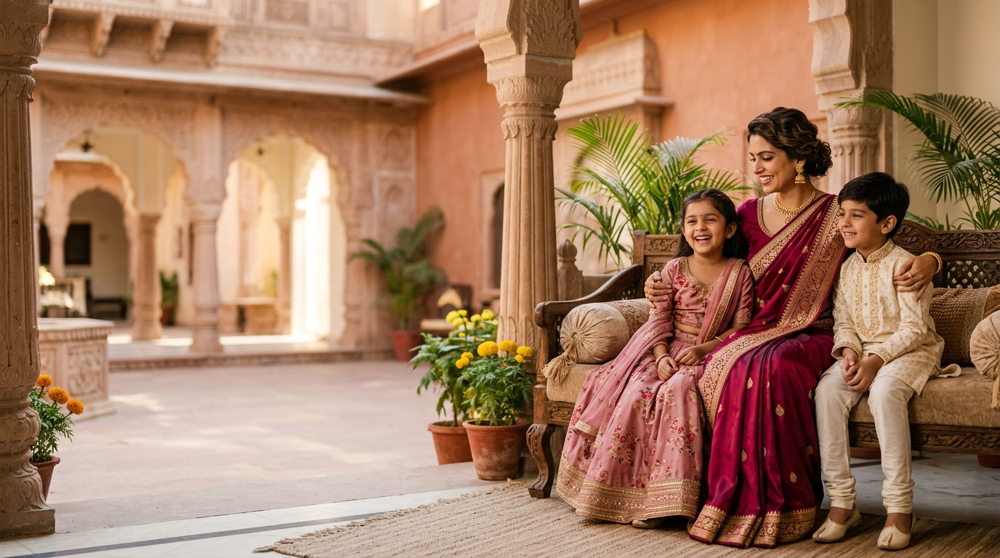

# 🌸 Kamal Selections — Official Local Fashion Website

> **"Fashion for Every Woman & Every Little One"**  
> *Est. 2021 • Ibrahim Complex, Main Road, Shadnagar, Telangana*



---

## 🌟 Executive Summary

**Kamal Selections** is a fast, SEO/AEO/GEO-focused local fashion web application built for a premier women's and kids' retail clothing store in **Shadnagar, Telangana**. Designed with a high-end luxury fashion aesthetic—featuring deep burgundy, rich magenta, champagne gold, and warm cream palettes, botanical line-art SVGs, curved section transitions, and typography driven by Google Fonts (*Cinzel*, *Cormorant Garamond*, *Alex Brush*).

---

## 🚀 Key Features & Homepage Sections

1. **Header & Navigation Overlay**:
   - Glassmorphism sticky navbar with backdrop blur (`.navbar-header.scrolled`).
   - Interactive **Store Locator Modal**, **Size Guide Modal**, **Search Modal**, and **Mobile Slide-Out Drawer Nav**.

2. **Section 1: Hero Section**:
   - Full-screen editorial photograph backdrop with left-side burgundy vignette.
   - Gold lotus symbol (`<linearGradient id="goldGrad">`) and cursive script tagline (`Alex Brush`).
   - Benefit grid cards (*Trendy Styles*, *Quality Fashion*, *Fashion that fits your budget*).
   - Animated mouse scroll-down indicator and curved cream SVG transition wave.

3. **Section 2: Brand Introduction**:
   - Brand story & positioning (*Style That Fits Your Everyday*).
   - "Since 2021" floating lotus badge and 4 circular feature badges.

4. **Section 3: Women's Wear Showcase**:
   - 7 curated categories: **Dresses**, **Kurtis**, **Tops**, **Leggings**, **Burqa**, **3-Piece Sets**, **Party Wear**.
   - Asymmetrical 3-row gallery card grid (`row-large`, `row-medium`, `row-small`).
   - Category icon pill badges with individual SVG icons.

5. **Section 4: Kids Wear Showcase**:
   - 4 categories: **Girls Wear**, **Boys Wear**, **Frocks**, **Kids Sets**.
   - Soft-pink circular icon pills and 2x2 gallery grid.

6. **Section 5: Why Kamal Selections**:
   - Value-focused brand positioning statement (*Style That Fits Your Budget*).
   - 4-image detail collage with gold border frames and 4 numbered reason cards (`01` to `04`).

7. **Section 6: Our Store (Physical Store Location & Map)**:
   - Real store photo placeholder area & location pill tag (`KAMAL SELECTIONS · SHADNAGAR`).
   - Typographic location card with address, hours, call store link, and direct Google Maps directions CTA.
   - Embedded Google Maps iframe with overlay banner.

8. **Section 7: Latest Styles (Instagram Editorial Gallery)**:
   - Curated 6-tile asymmetrical editorial photo gallery.
   - Instagram handle badge (`@kamal_selection_`) and journey CTA.

9. **Section 8: Frequently Asked Questions (FAQ)**:
   - Schema.org `FAQPage` structured data for rich search snippet eligibility.
   - Gold thread SVG decorative art, prompt card, and stateful accordion.

10. **Section 9: Final Visit CTA**:
    - Full-width cinematic campaign visual with deep burgundy overlay.
    - Champagne gold botanical SVG frame accent.

11. **Section 10: Site Footer**:
    - Deep burgundy background with top champagne gold divider line.
    - Horizontal brand header split, 4 navigation columns, contact strip with line icons, social strip, legal links, and copyright bar.

---

## 🛠️ Tech Stack & Architecture

- **Framework**: [Next.js 14 (App Router)](https://nextjs.org/)
- **Language**: [TypeScript](https://www.typescriptlang.org/)
- **Styling**: Vanilla CSS Design System (`styles.css` / `globals.css`) + Tailwind CSS
- **Typography**: Google Fonts (*Alex Brush*, *Cinzel*, *Cormorant Garamond*, *Outfit*, *Plus Jakarta Sans*)
- **Structured Data**: Schema.org `LocalBusiness` & `FAQPage` JSON-LD

---

## 📁 Project Directory Structure

```text
kamal-selections/
├── public/
│   ├── assets/                 # High-resolution brand photos, category images & logos
│   └── brand/                  # Vector logos & icon marks
├── src/
│   ├── app/
│   │   ├── layout.tsx          # Root Layout (Google Fonts & LocalBusiness Schema)
│   │   ├── page.tsx            # Main Homepage composition with IntersectionObserver
│   │   ├── sitemap.ts          # Dynamic XML Sitemap generator
│   │   ├── robots.ts           # Robots.txt configuration
│   │   ├── not-found.tsx       # Custom 404 Page
│   │   ├── women/              # Women's wear collection page shell
│   │   ├── kids/               # Kids wear collection page shell
│   │   ├── store/              # Store details page shell
│   │   ├── contact/            # Contact page shell
│   │   ├── faq/                # Full FAQ page shell
│   │   └── size-guide/         # Size Guide page shell
│   ├── components/
│   │   ├── home/               # Homepage editorial section components
│   │   │   ├── Hero.tsx
│   │   │   ├── BrandIntroduction.tsx
│   │   │   ├── WomensPreview.tsx
│   │   │   ├── KidsPreview.tsx
│   │   │   ├── WhyKamalSelections.tsx
│   │   │   ├── StorePreview.tsx
│   │   │   ├── LatestStyles.tsx
│   │   │   ├── FAQPreview.tsx
│   │   │   └── FinalVisitCTA.tsx
│   │   ├── layout/             # Header, Navbar, MobileMenu, Footer & PageContainer
│   │   └── modals/             # StoreModal, SizeGuideModal & SearchModal
│   ├── data/                   # Centralized data files (brand, navigation, womens, kids, faq, store)
│   ├── lib/                    # SEO metadata and JSON-LD schema generators
│   ├── styles/                 # globals.css (Complete Kamal Selections Design System)
│   └── types/                  # TypeScript interfaces and data definitions
├── next.config.mjs             # Next.js 14 Configuration
├── package.json
├── tsconfig.json
└── README.md
```

---

## 💻 Local Development Setup

### Prerequisites
- **Node.js**: v18.0.0 or higher
- **npm**: v9.0.0 or higher

### Installation Steps

1. **Clone the Repository**:
   ```bash
   git clone https://github.com/hamid220-kamal/Kamal-selections.git
   cd Kamal-selections
   ```

2. **Install Dependencies**:
   ```bash
   npm install
   ```

3. **Run Development Server**:
   ```bash
   npm run dev
   ```
   Open `http://localhost:3000` in your web browser.

4. **Build for Production**:
   ```bash
   npm run build
   npm run start
   ```

---

## 📍 Store Information & Contact

- **Store Name**: Kamal Selections
- **Location**: Ibrahim Complex, Main Road, Shadnagar, Telangana, India
- **Phone**: `8332059777`
- **Instagram**: [@kamal_selection_](https://www.instagram.com/kamal_selection_/)
- **Store Hours**: Open Daily from 10:00 AM — 9:00 PM

---

© 2026 Kamal Selections. All rights reserved.
